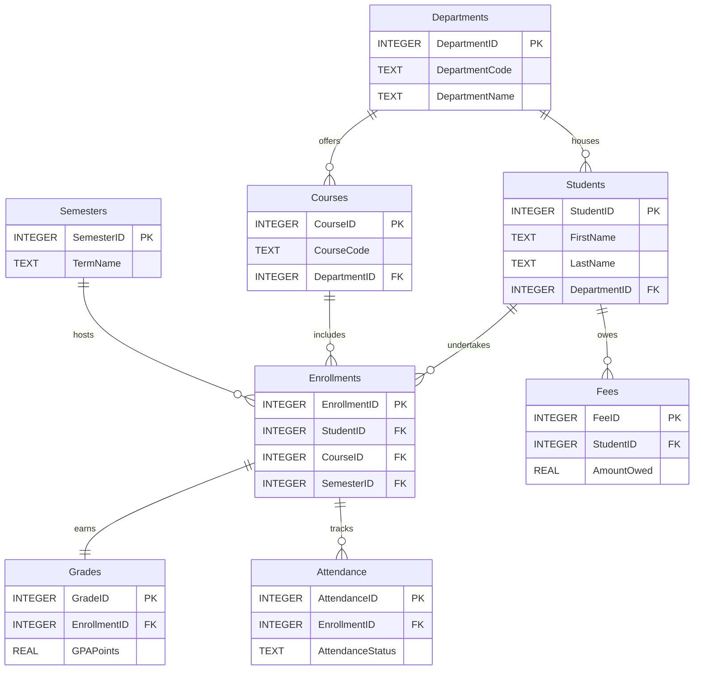

# 🧩 Entity Relationship Diagram (ERD)

The following diagram illustrates the normalized relational architecture (3NF) of the Student Management System. It highlights the primary key (PK) and foreign key (FK) mappings that ensure referential integrity across the data model.

