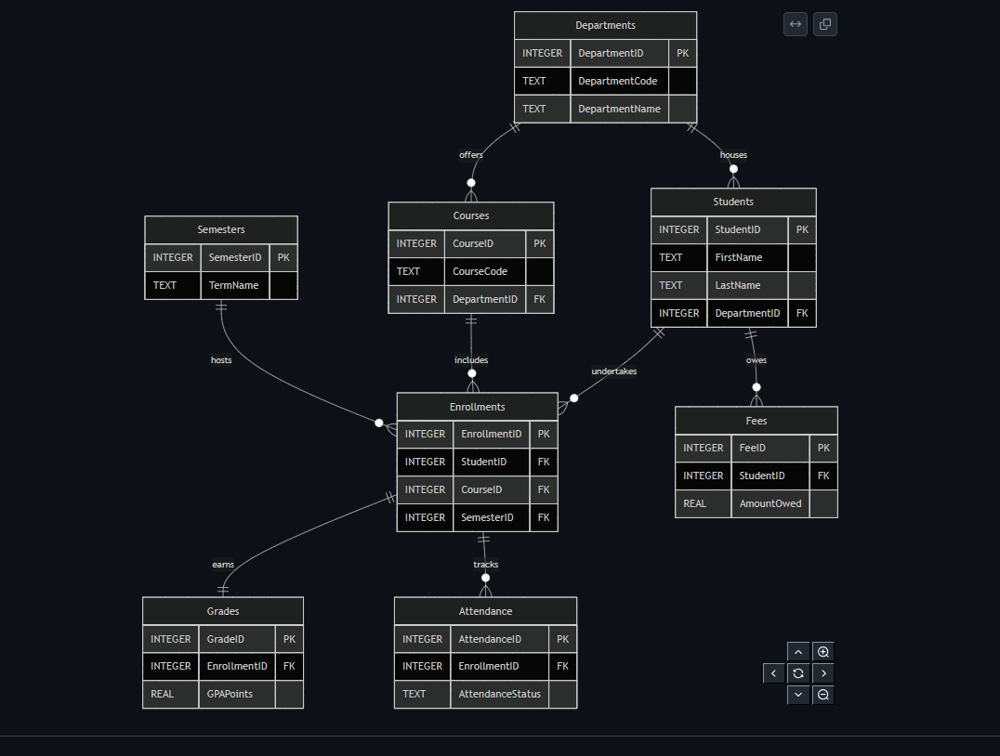
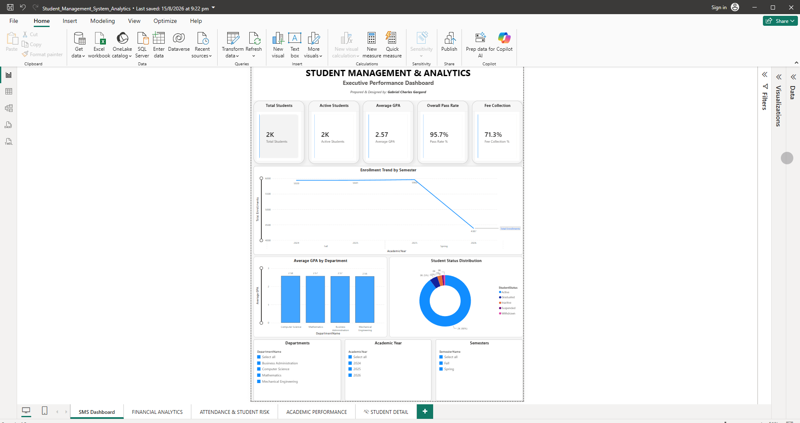
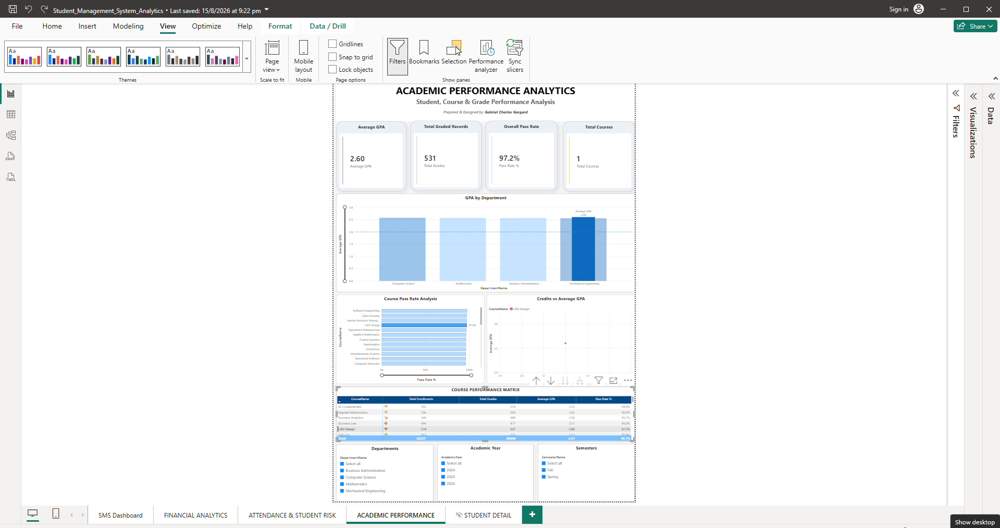
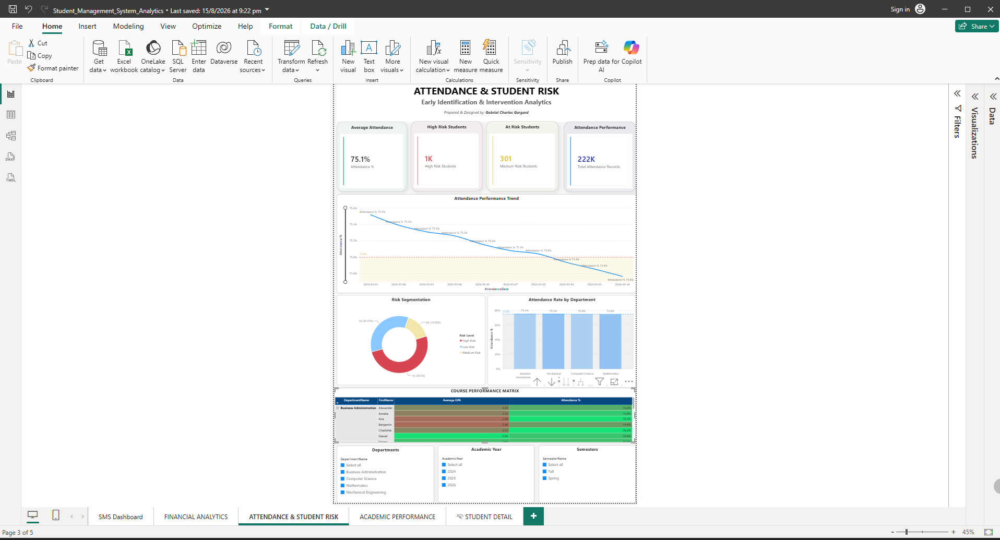
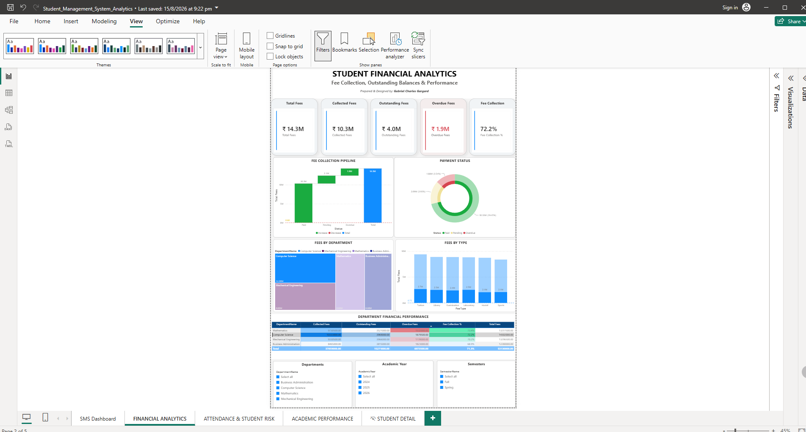

# 🎓 Student Management System & Analytics

An end-to-end data analytics and business intelligence solution designed to transform raw academic and financial records into actionable institutional insights. 

| Technology | Purpose |
| :--- | :--- |
| **SQLite3** | Transactional relational database |
| **SQL** | Data transformation, views, and complex analytics |
| **Excel** | Baseline data ingestion and ad-hoc profiling |
| **Power BI** | Semantic modeling and interactive visualization |
| **DAX** | Advanced semantic calculations and filtering |

## 🏗️ System Architecture & Engineering

This project goes beyond standard visualization by establishing a robust backend data infrastructure before surface-level analytics.

*   **Database Engine:** 8 core tables with a fully normalized design (3NF), utilizing strict constraints, foreign keys, and strategic indexing.
*   **Analytical Layer:** 20+ advanced SQL queries and 7 analytical views utilizing CTEs, window functions, and cross-table aggregations.
*   **Semantic Model:** Power BI Star Schema featuring 7 core relationships and 30+ custom DAX measures for dynamic time-intelligence and risk classification.

## 🎥 Dashboard Portfolio

*(Note to recruiters: The full interactive `.pbix` file is available in the `PowerBI/` directory for download and review).*

### 📊 Executive Overview
Tracks high-level institutional health, including total enrollment, aggregate financial standing, and global attendance metrics.

### 🎓 Academic Performance
Analyzes GPA variance across departments, course-level grade distributions, and term-over-term academic trends.

### ⚠️ Risk Analytics
Correlates attendance drops with academic decline to identify students at high risk of failure or dropout.

### 💰 Financial Health
Monitors outstanding fee balances, payment statuses, and 30-day recovery forecasts.

## 🛠️ Qualifications Demonstrated
* **Database Design:** DDL schema creation, relational integrity, data seeding.
* **Data Transformation:** DML, complex joins, data quality validation.
* **Business Intelligence:** Star schema modeling, DAX measure creation, UI/UX dashboard design.

## 📄 Technical Documentation
Comprehensive system documentation can be found in the `Documentation/` directory, including:
* [Entity Relationship Diagram (ERD)](Documentation/ERD.md)
* [System Data Dictionary](Documentation/Data_Dictionary.md)
* [Validation & Quality Report](Documentation/Validation_Report.json)
* [Internship Project Report](Documentation/Internship_Report.md)

---
*The dataset utilized in this repository is synthetically generated for demonstration and academic purposes.*